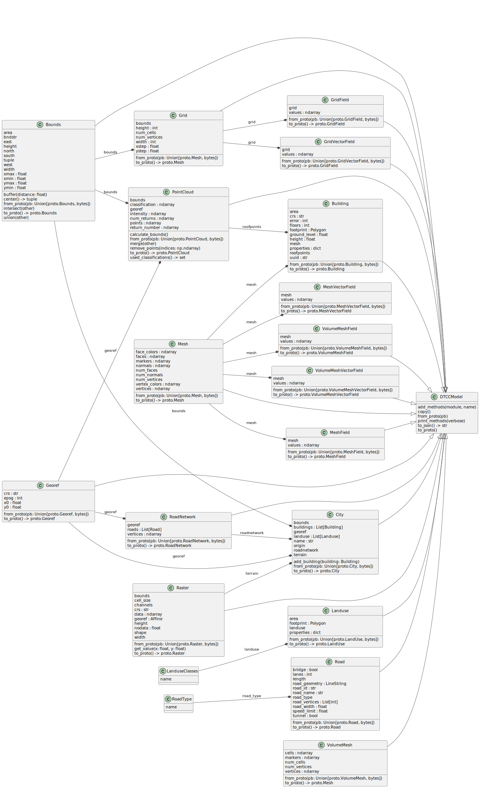

Data Model
==========

The DTCC Data Model is used to describe city models, including the city's
geometry, city metadata, raw data such as point clouds and raster images, as
well as simulation results.

The data model is implemented as
`Python dataclasses <https://docs.python.org/3/library/dataclasses.html>`_ 
provided as part of the DTCC Python package. In addition the DTCC Data Model is
implemented in
`Protobuf <https://protobuf.dev/>`_ which enables data exchange over the web and with
other languages.

The data model is work in progress and an overview is provided in the UML
diagram included below. The data model is document in detail as part of the `API
Reference <api.html>`_.

